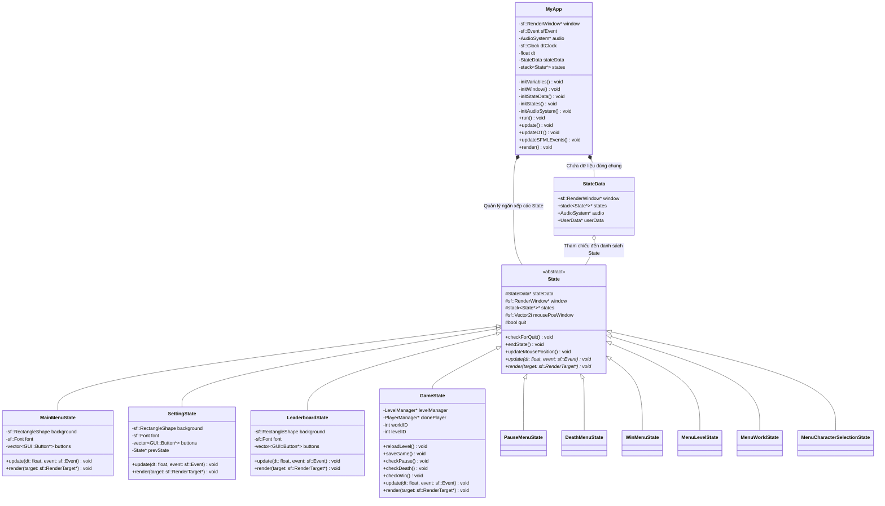
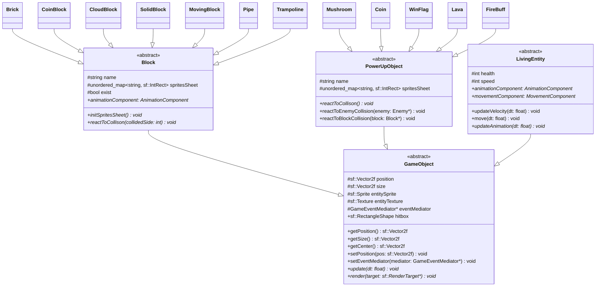
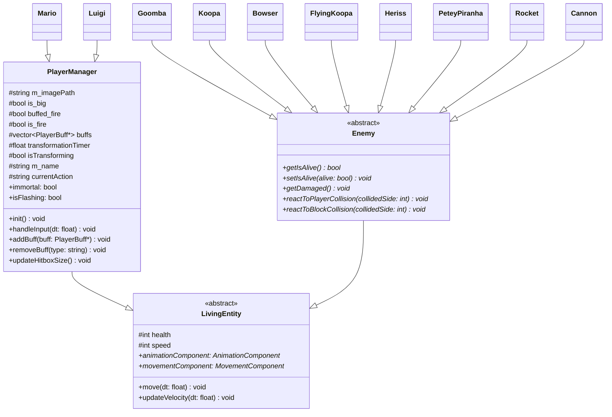
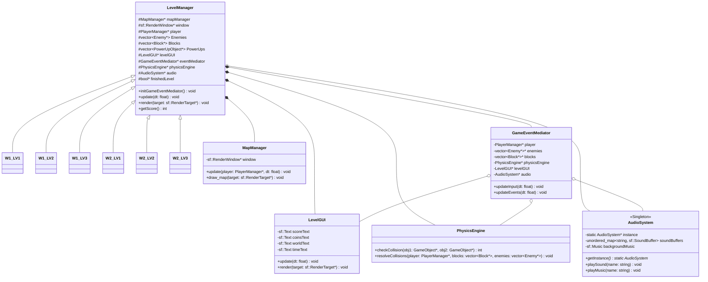
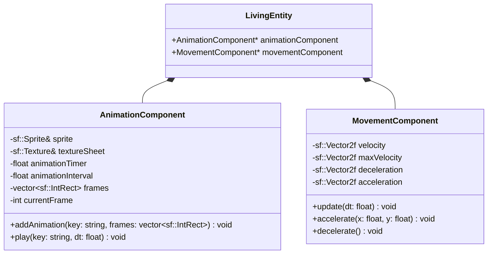

# Tài liệu Thiết kế Kiến trúc Đồ án Super Mario (SFML)

Sơ đồ kiến trúc dưới đây mô tả chi tiết toàn bộ các lớp (class), thuộc tính (attributes), phương thức (methods), và mối quan hệ (inheritance, composition, association) trong project game Super Mario. Các thành phần liên quan đến AI/Chatbot đã được loại bỏ hoàn toàn để phản ánh đúng cấu trúc cốt lõi của game.

Do hệ thống lớp trong project khá lớn, tài liệu này được chia thành các sơ đồ chuyên biệt để bạn có cái nhìn chi tiết và trực quan nhất.

---

## 1. Sơ đồ Quản lý Trạng thái Game (State Management)
Quản lý luồng hoạt động của ứng dụng bằng **State Pattern**. `MyApp` là lớp khởi chạy và chứa một Stack các `State`.

---

## 2. Sơ đồ Lớp Các Đối Tượng Trong Game (GameObject Hierarchy)
Tất cả các thực thể hiển thị và tương tác vật lý trong game đều kế thừa từ `GameObject`.

---

## 3. Hệ thống Người chơi và Kẻ địch (Player & Enemies)
Kế thừa từ `LivingEntity` để sử dụng các cơ chế di chuyển, gia tốc, trọng lực và hoạt ảnh phức tạp.

---

## 4. Cơ chế Hoạt động của Màn chơi (Level & Core Engine)
`LevelManager` đóng vai trò là "Controller" của từng màn chơi, điều phối các thành phần hỗ trợ bao gồm Renderer, Collision, Audio và Event Dispatching.

---

## 5. Mối quan hệ giữa các Thành phần Hỗ trợ (Components)
Mỗi thực thể `LivingEntity` đều sở hữu `AnimationComponent` và `MovementComponent` để tách biệt phần xử lý logic di chuyển và vẽ hoạt ảnh khỏi logic lớp chính.

---

## Tóm tắt các Design Pattern được áp dụng trong Đồ án:
1. **State Pattern**: Dùng để quản lý các trạng thái/màn hình của game thông qua class `State` và ngăn xếp `states` trong `MyApp`.
2. **Mediator Pattern**: Thể hiện qua `GameEventMediator`, giúp làm cầu nối trao đổi sự kiện và giải quyết va chạm giữa các thực thể (`Player`, `Enemies`, `Blocks`, `AudioSystem`, `LevelGUI`) mà không bắt chúng phải tham chiếu trực tiếp chéo nhau.
3. **Singleton Pattern**: Được áp dụng vào `AudioSystem` để đảm bảo tài nguyên âm thanh chỉ được tải một lần duy nhất và có thể truy cập từ bất kỳ đâu.
4. **Factory Method Pattern**: Class `Character` với hàm static `createPlayer` giúp sinh đối tượng `PlayerManager` (chọn Mario hoặc Luigi) dựa trên chuỗi tên truyền vào.
5. **Component Pattern**: Class `LivingEntity` chia tách các chức năng thành `AnimationComponent` và `MovementComponent` để tăng khả năng tái sử dụng.
