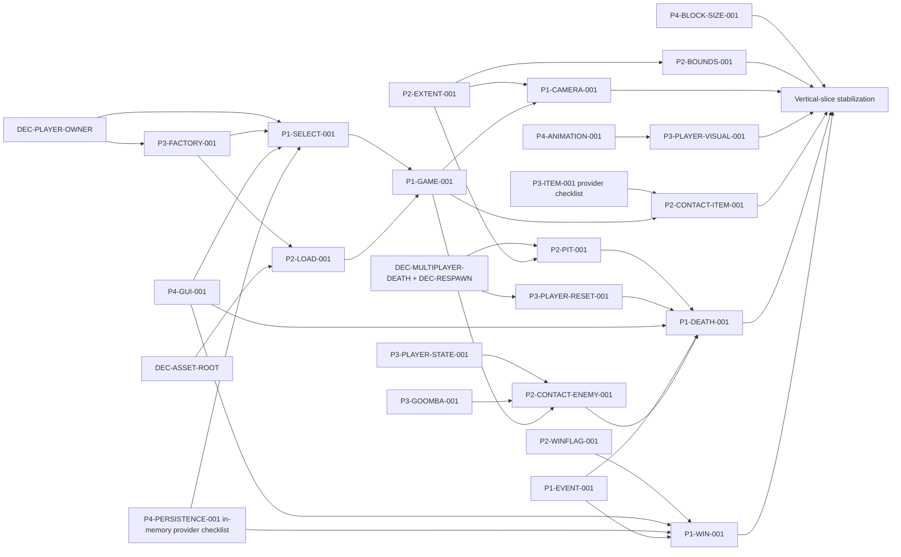

# Group4 Super Mario — Critical Path

The critical path is the shortest production-shaped route from the current Brick-test entry point through both stable death and win transitions in separate executions. It preserves the existing P2/P4 runtime baselines and uses provider-first merges to avoid rewriting central files twice.

## 1. First vertical-slice exit criterion

The first vertical slice exits only when a production launch can:

1. enter the P1 state flow;
2. select a valid 1P or approved 2P session;
3. retain stable player owners under approved `DEC-PLAYER-OWNER` (P1 is the recommended default, not a current fact);
4. create one P1-owned active level and pass borrowed player views to P2;
5. report stage load success/failure explicitly;
6. render a loaded world and visible player at 32-pixel world scale;
7. move and collide using the preserved P2 Block/runtime ownership foundation;
8. execute representative enemy, item, Block, and hazard behavior;
9. clamp the camera and world bounds to dynamic map extent;
10. emit exactly-once death and completion events in separate executions;
11. defer destruction/state replacement until level update returns; and
12. show each resulting death/win state without dangling owners or duplicate outcomes.

A direct test executable, hard-coded fake callback, manually positioned stack player, or test-only stage constructor does not satisfy the exit criterion.

## 2. The 25 P0 blockers

| Owner | P0 task IDs | Count |
|---|---|---:|
| P1 | `P1-APP-001`, `P1-STATE-001`, `P1-SELECT-001`, `P1-GAME-001`, `P1-CAMERA-001`, `P1-EVENT-001`, `P1-DEATH-001`, `P1-WIN-001` | 8 |
| P2 | `P2-LOAD-001`, `P2-EXTENT-001`, `P2-BOUNDS-001`, `P2-PIT-001`, `P2-CONTACT-ENEMY-001`, `P2-CONTACT-ITEM-001`, `P2-LAVA-001`, `P2-WINFLAG-001` | 8 |
| P3 | `P3-PLAYER-VISUAL-001`, `P3-PLAYER-STATE-001`, `P3-PLAYER-RESET-001`, `P3-GOOMBA-001`, `P3-ITEM-001`, `P3-FACTORY-001` | 6 |
| P4 | `P4-ANIMATION-001`, `P4-BLOCK-SIZE-001`, `P4-GUI-001` | 3 |

At baseline, 12 P0 tasks are `READY` and 13 are `BLOCKED`. The `READY` tasks should start while humans close the decisions that gate the blocked chain.

## 3. Dependency graph

The diagram shows gating, not file ownership. P2 owns world detection/orchestration, P3 owns entity behavior, P4 owns animation/block presentation, and P1 owns state-transition sequencing. Selected-player session ownership remains pending `DEC-PLAYER-OWNER`.

## 4. Ordered waves

### Wave 0 — decisions and contract confirmation

No source merge is required for this wave.

| Gate | Unblocks | Required outcome |
|---|---|---|
| `DEC-PLAYER-OWNER` | P1 selection/GameState, P3 factory/reset | Explicit runtime owner and borrow/rebind lifetime |
| `DEC-ASSET-ROOT` | P2 load and P4 package path | One launch/package-relative read-only runtime asset policy |
| `DEC-MULTIPLAYER-DEATH` + `DEC-RESPAWN` | P2 pit/death consumer, P3 reset, P1 death | Affected-player, lives, reset/reload, and Game Over policy |

The other four decisions can remain open through the basic slice if their affected behavior is isolated: block actor eligibility beyond the already-tested normal Brick, Cloud semantics, WinFlag animation polish, and durable persistence. The slice uses audited in-memory UserData fields and emits stable downstream events; it does not claim persistence complete. The required WinFlag base-anchor correction is not optional.

### Wave 1 — parallel contract-safe foundations

These may proceed concurrently because their primary files do not overlap, subject to provider interface coordination:

| Task | Deliverable before consumers start |
|---|---|
| `P1-STATE-001` | stable deferred state-stack/lifecycle API plus runnable lifecycle check |
| `P1-APP-001` | production loop using the State API; temporary minimal initial state allowed only as a bridge |
| `P1-EVENT-001` | typed non-owning event surface and exactly-once/lifetime check |
| `P2-EXTENT-001` | explicit valid world rectangle after successful load |
| `P2-LAVA-001` | actual-death-only, once-only callback behavior |
| `P2-WINFLAG-001` | base-anchor geometry and one-shot completion provider |
| `P3-PLAYER-STATE-001` | safe size/power/damage transition behavior |
| `P3-GOOMBA-001` | P3 semantic contact result and visible internal state |
| `P4-ANIMATION-001` | stable entity-facing animation behavior and failure check |
| `P4-BLOCK-SIZE-001` | one 32×32 Block visual/physics invariant API |
| `P4-GUI-001` | `CON-P1-P4-GUI` value-action surface plus minimum visible/keyboard-operable selection, death, and win controls without P1 state ownership |

`P3-PLAYER-VISUAL-001` may begin after the small P4 animation surface is agreed; its implementation can run in parallel with other Wave 1 work.

Also run the explicitly unblocked in-memory provider checklist inside still-`BLOCKED` `P4-PERSISTENCE-001`: validate the exact nine IDs, safe default/current/unlocked snapshots, all eight successors plus terminal `W3_LV3`, and duplicate-completion idempotence. Land that provider evidence before `P1-SELECT-001` or `P1-WIN-001` integrates `CON-P1-P4-PROGRESSION`; the parent P4 card remains `BLOCKED` for durable I/O while `DEC-PERSISTENCE` is open.

### Wave 2 — ownership, factory, and load providers

Recommended merge order:

1. `P3-FACTORY-001` provider surface after `DEC-PLAYER-OWNER`.
2. `P1-SELECT-001` uses current in-memory unlock values and constructs the approved session owner/stable borrowed view after `DEC-PLAYER-OWNER`; durable restoration is later.
3. `P2-LOAD-001` readiness/error/path contract after `DEC-ASSET-ROOT`.
4. Contract-only integration check for selection → player owner → borrowed view → load.

Exit gate:

- failed load is visible and safe;
- successful load produces valid extent and owners;
- no player pointer outlives the owner approved by `DEC-PLAYER-OWNER`;
- no P2 map/runtime object has more than one owner.

### Wave 3 — active GameState, camera, and bounds

Recommended merge order:

1. `P2-BOUNDS-001` consumes the extent without changing P1 files.
2. `P1-GAME-001` owns the active level, injects players/callbacks, and defers transitions.
3. `P1-CAMERA-001` consumes the extent and restores the UI view.
4. `P3-PLAYER-VISUAL-001` and `P4-BLOCK-SIZE-001` receive visual verification in the production render path.

Exit gate:

- production launch reaches a successfully loaded representative stage;
- player/world rendering is visible and aligned;
- camera clamps at both ends for dynamic width and for a world smaller than the viewport;
- player cannot leave approved horizontal bounds;
- update/render occur exactly once per frame.

### Wave 4 — representative contacts and outcomes

Provider-first merge order:

1. P3 finalizes `P3-GOOMBA-001` and the unblocked provider checklist inside still-`BLOCKED` `P3-ITEM-001` (typed outcomes, proposed growth bounds, lifecycle, and focused checks). The parent remains `BLOCKED` until P2 integration closes it.
2. P1 finalizes outcome payloads in `P1-EVENT-001` without taking P3/P2 ownership.
3. P2 lands `P2-CONTACT-ENEMY-001` and then `P2-CONTACT-ITEM-001` as separate commits in the central runtime.
4. Re-run `BASE-P2-RUNTIME-001` plus new pair-order/duplicate-outcome checks.

Exit gate:

- one stomp and one harmful side contact are distinguishable;
- invulnerability/dead/inactive filtering prevents duplicate effects;
- Coin/Mushroom collection happens exactly once;
- owned enemies/items are cleaned up through the existing owner barrier;
- score/coin/death semantics reach P1 without direct P2/P3 mutation of P4 storage.

### Wave 5 — pit, reset, death, and completion transitions

Recommended merge order:

1. `P3-PLAYER-RESET-001` after death/respawn/player-owner decisions.
2. `P2-PIT-001` using the map-derived extent and one-tile margin specified in `CON-P1-P2-DEATH`.
3. `P1-DEATH-001` consuming P2 death and P3 reset under the approved lives policy.
4. Use the audited current in-memory UserData lives/progression fields, then complete `P1-WIN-001` consuming `P2-WINFLAG-001` and emitting a stable downstream completion event. Durable P4 persistence remains post-slice.
5. Run death and completion in separate executions, then in repeated-overlap/duplicate-event scenarios.

Exit gate:

- pit and lethal hazard/contact emit one event per occurrence;
- a powered non-dead damage downgrade is not reported as death;
- active-level/state destruction is deferred until update returns;
- restart/reload or Game Over follows the approved policy with no stale player views;
- base-anchored flag completes once and shows the win/next/final state.

### Wave 6 — vertical-slice stabilization

- Run all 25 P0 cards' applicable checks and record `S/I/R/V/G`.
- Re-run the 27 baseline runtime checks.
- Run SFML 3.1 syntax/compile/link for production and registered slice tests.
- Perform 1P visual/gameplay verification and approved 2P verification if 2P is in the first-slice decision profile.
- Triage failures back to existing task, contract, decision, or `KNOWN_MAP_EDIT_ITEM`; do not create map-specific code.

Only then may the 25 P0 task cards be `DONE` and the team claim a complete first vertical slice.

## 5. Work after the first slice

### Parallel P1 completion

- `P1-MENU-001` can progress early and integrate P4 GUI/Audio later.
- `P1-PAUSE-001` is late integration after stable GameState/death reset.

### Parallel P2 completion

- `P2-ENV-001` and `P2-PROJECTILE-001` can run on preserved ownership/physics contracts.
- `P2-CLEANUP-001` follows extent.
- `P2-VARIANT-WIRE-001` waits for P4 variant/Cloud behavior and P3 payload types.
- `P2-NINE-LEVEL-001` is one shared readiness task, followed by nine `LV-*` records.

### Parallel P3 completion

- `P3-FOUNDATION-001`, `P3-KOOPA-001`, `P3-AIR-HERISS-001`, and much of `P3-BOSS-001` can proceed in distinct files.
- `P3-FIRE-001` waits for a P2 runtime ownership/spawn contract; it must not retain a raw projectile owner.

### Parallel P4 completion

- `P4-QUESTION-BLOCK-001`, `P4-AUDIO-001`, and `P4-GUI-001` can proceed early.
- `P4-PAYLOAD-BLOCK-001` and `P4-CLOUD-001` wait for their decisions and provider dependencies.
- `P4-HUD-001` waits for P1 snapshots/events.
- `P4-PERSISTENCE-001`, `P4-LEADERBOARD-001`, and `P4-PACKAGE-001` follow approved storage/asset policy and stable gameplay flow.

## 6. Conflict-risk merge lanes

| Hot file(s) | Tasks that may collide | Required sequencing |
|---|---|---|
| `LevelManager.hpp/.cpp` | P2 load, extent, pit, cleanup, contacts, projectiles, WinFlag, variants, nine-level; P1 consumers may request API | P2 primary editor; one task-sized commit at a time; P1/P3/P4 use `XREQ-*`, provider change lands first |
| `MapManager.hpp/.cpp` | P2 load/extent/variant/nine-level | Load/extent surface first, then variant mapping, then validation-only changes |
| `PhysicsEngine.hpp/.cpp` | P2 bounds/contacts/environment; P4/P3 need context | Agree collision result/context contract; P2 edits; run baseline checks after every merge |
| `GameState.hpp/.cpp` | P1 GameState/camera/death/win/pause | P1 sequential commits: owner shell → camera → event queue → death → win → pause |
| `PlayerManager.hpp/.cpp` | P3 visual/state/reset/item/fire; P1/P2 consumers | P3 primary editor; state API before reset/fire; consumer requests provider changes |
| `Block.hpp/.cpp` | P4 size/payload/Cloud contract; P2 collision consumer | P4 size invariant first; actor-context decision/interface next; P2 consumer last |
| `src/main.cpp` | P1 application vs P4 historical Brick test | P1 replaces production entry once MyApp check passes; preserve Brick behavior in tests, not production main |
| `CMakeLists.txt` | P1 missing MyApp source, tests, P4 SFML/package | Coordinate one build editor; add production sources before late dependency/package changes; avoid drive-by formatting |

## 7. Stop-the-line conditions

Pause the affected merge lane and keep the task `BLOCKED` or return it to `IN_PROGRESS` if any occurs:

- a player or runtime-object owner is ambiguous or duplicated;
- a raw pointer is retained beyond the provider-guaranteed lifetime;
- load failure enters normal update/render;
- state/level destruction occurs during its own callback traversal;
- a collision produces duplicate score, life, death, completion, or spawn outcomes;
- the 27 verified runtime checks regress;
- a Block becomes collidable after same-frame deactivation;
- 16×16 art is claimed visually correct against a 32×32 hitbox without verification;
- an SFML 2 API enters required source/tests;
- an engine change special-cases one map rather than fixing shared behavior;
- a Group5 raw-owner/chatbot/LLM pattern enters Group4.

## 8. Final critical-path completion

After the vertical slice, full completion proceeds through all P1/P2/P3/P4 P1 tasks, then P4's two P2 release tasks, then all nine level validations. `LV-W3-LV3` must demonstrate final-game completion and persistence. The project is not complete while any required task or contract is blocked, any level validation is missing, or release launch depends on an undocumented working directory.
